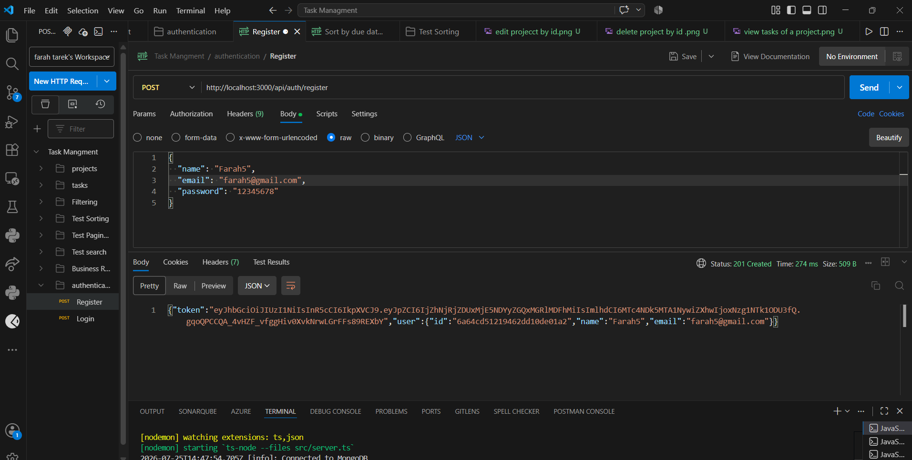
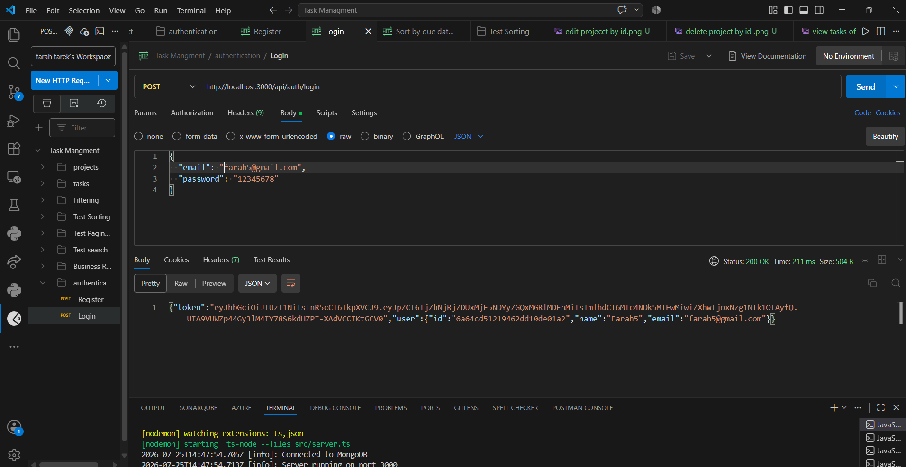
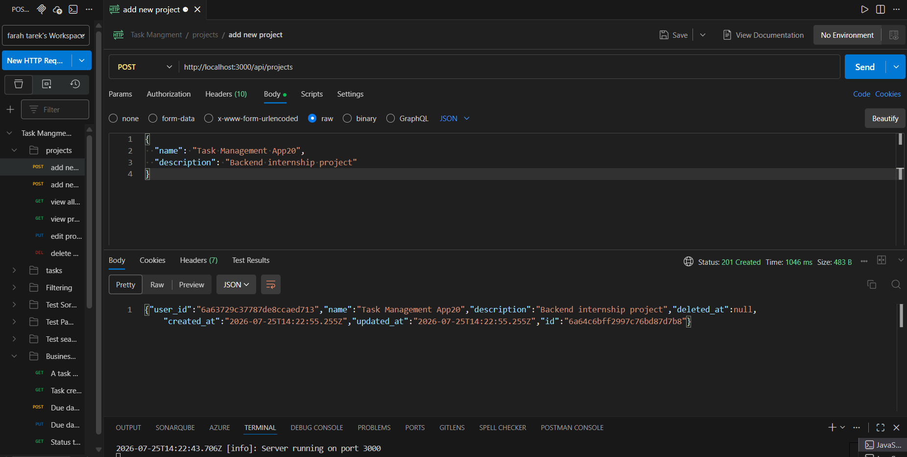
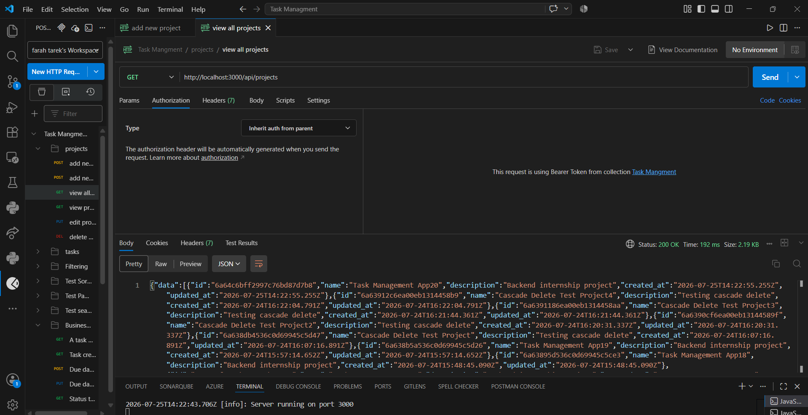
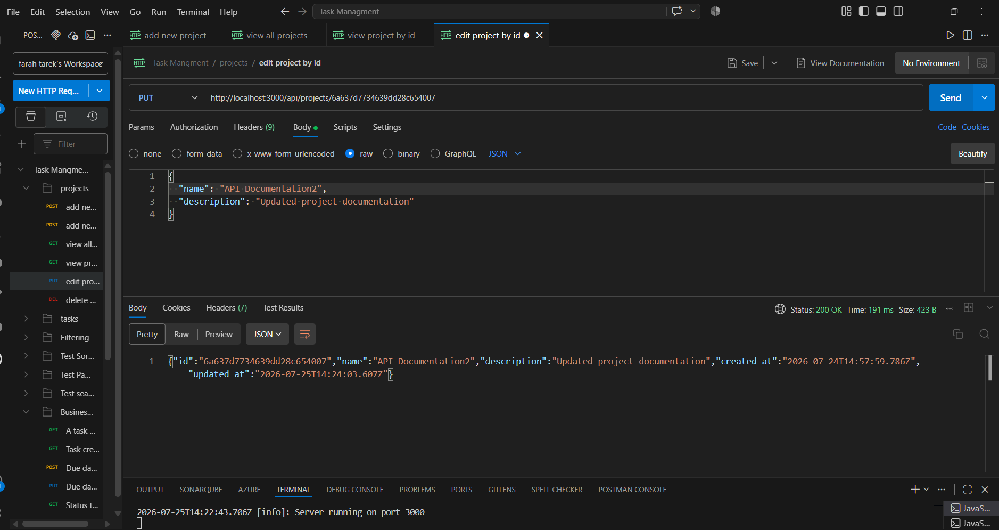
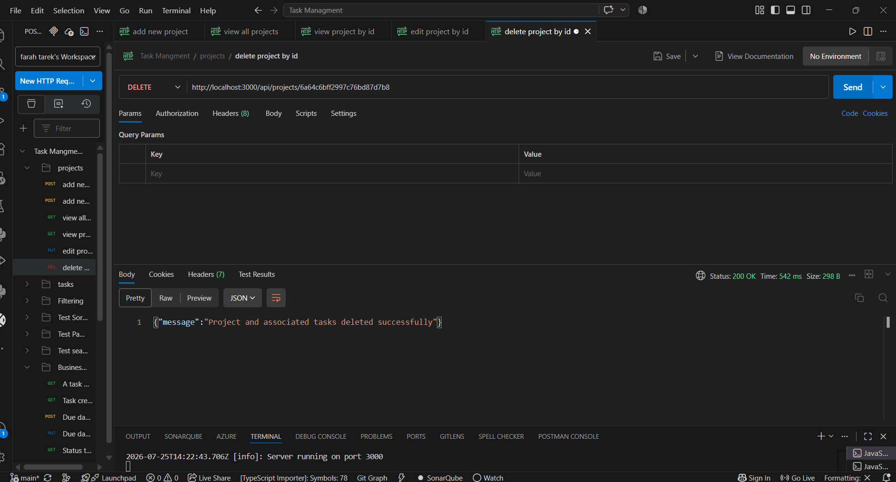
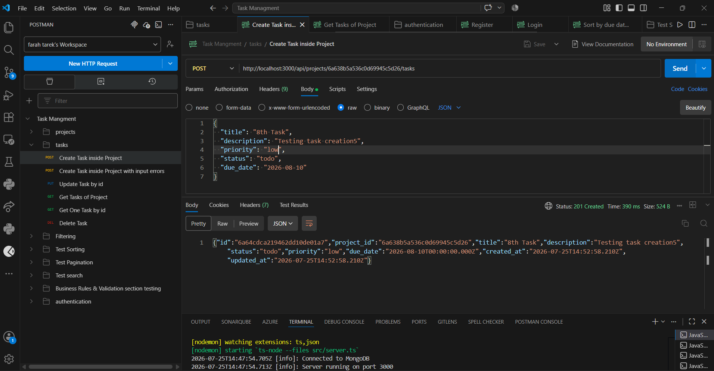
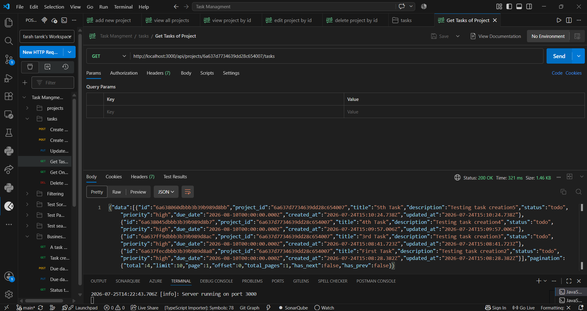
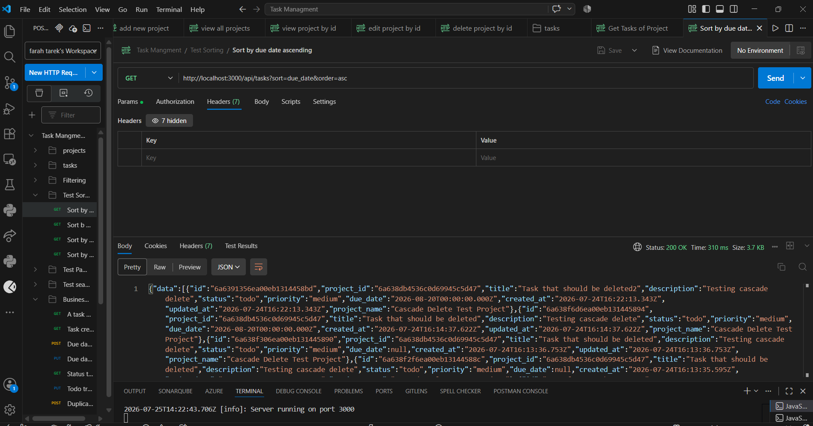

# Task Management REST API

A Task Management REST API built with **Node.js**, **Express**, **TypeScript**, and **MongoDB**.

The API allows users to manage projects and tasks with JWT authentication, validation, filtering, sorting, pagination, searching, and automated testing.

---

# Features

## Authentication

- JWT-based authentication
- User registration and login
- Protected API routes
- User-based data isolation

## Projects

- Full CRUD operations
- Unique project names per user
- Project ownership
- Cascade delete associated tasks

## Tasks

- Full CRUD operations
- Tasks belong to exactly one project
- Status management:
  - `todo`
  - `in_progress`
  - `done`

- Priority management:
  - `low`
  - `medium`
  - `high`

- Due date validation (cannot be in the past)

## Task Management Features

- Filtering by:
  - status
  - priority
  - due date range

- Sorting by:
  - due_date
  - priority
  - created_date

- Pagination with total count

- Search using `q` parameter across:
  - title
  - description

## Additional Features

- MongoDB migrations using migrate-mongo
- Database seed script
- Docker and Docker Compose support
- Soft delete functionality
- Unit and integration tests

---

# Tech Stack

- Node.js
- Express.js
- TypeScript
- MongoDB
- Mongoose
- JWT Authentication
- Jest
- Supertest
- Docker

---

# Requirements

Before running the project, make sure you have:

- Node.js 18+ (20 recommended)
- MongoDB 6+
- npm

---

# Installation

## 1. Clone Repository

```bash
git clone https://github.com/Farah-Tarek101/Task-Mangment.git

cd Task-Mangment
```

---

## 2. Install Dependencies

```bash
npm install
```

---

## 3. Configure Environment Variables

Create a `.env` file in the project root:

```env
PORT=3000
MONGODB_URI=mongodb://localhost:27017/task_management
JWT_SECRET=my_task_management_secret
NODE_ENV=development
```

For testing:

Create `.env.test`

```env
NODE_ENV=test
JWT_SECRET=my_task_management_secret
```

Example `.env.example`:

```env
PORT=3000
MONGODB_URI=mongodb://localhost:27017/task_management
JWT_SECRET=your_secret_here
NODE_ENV=development
```

---

# Database Setup

## Option 1: Local MongoDB

```env
MONGODB_URI=mongodb://localhost:27017/task_management
```

---

## Option 2: Docker MongoDB

```bash
docker run -d \
-p 27017:27017 \
--name task-management-mongo \
mongo:7
```

---

# Database Migrations

Apply migrations:

```bash
npm run migrate:up
```

Check migration status:

```bash
npm run migrate:status
```

Rollback latest migration:

```bash
npm run migrate:down
```

---

# Seed Database (Optional)

Create sample user, projects, and tasks:

```bash
npm run seed
```

---

# Running the Application

## Development Mode

```bash
npm run dev
```

## Build TypeScript

```bash
npm run build
```

## Production Mode

```bash
npm start
```

The API will run on:

```
http://localhost:3000
```

---

# Docker Support

Run API and MongoDB using Docker Compose:

```bash
docker-compose up --build
```

This starts:

- MongoDB container
- Node.js API container

API URL:

```
http://localhost:3000
```

Stop containers:

```bash
docker-compose down
```

Remove containers and volumes:

```bash
docker-compose down -v
```

---

# API Documentation

Base URL:

```
http://localhost:3000/api
```

---

# Authentication API

| Method | Endpoint | Description |
|---|---|---|
| POST | `/auth/register` | Register a new user |
| POST | `/auth/login` | Login and receive JWT token |

---

# Projects API

| Method | Endpoint | Description |
|---|---|---|
| GET | `/projects` | Get all projects |
| POST | `/projects` | Create project |
| GET | `/projects/:id` | Get project by ID |
| PUT | `/projects/:id` | Update project |
| DELETE | `/projects/:id` | Delete project and tasks |

Example:

```json
{
  "name": "Website Redesign",
  "description": "Redesign company website"
}
```

---

# Tasks API

| Method | Endpoint | Description |
|---|---|---|
| GET | `/tasks` | Get all tasks |
| GET | `/projects/:projectId/tasks` | Get project tasks |
| POST | `/projects/:projectId/tasks` | Create task |
| GET | `/tasks/:id` | Get task |
| PUT | `/tasks/:id` | Update task |
| DELETE | `/tasks/:id` | Delete task |

Example:

```json
{
  "title": "Implement homepage",
  "description": "Build responsive homepage",
  "status": "todo",
  "priority": "high",
  "due_date": "2026-08-01"
}
```

---

# Filtering, Sorting and Pagination

Example:

```
GET /api/tasks?status=todo&priority=high&page=1&limit=10
```

Supported parameters:

| Parameter | Description |
|---|---|
| status | Filter by status |
| priority | Filter by priority |
| due_date_from | Start date |
| due_date_to | End date |
| sort | due_date, priority, created_at |
| order | asc, desc |
| page | Page number |
| limit | Number of results |
| q | Search title and description |

---

# Postman Collection

A Postman collection is included for testing all API endpoints.

File:

```
Task Mangment.postman_collection.json
```

The collection includes:

## Authentication

- Register
- Login
- JWT authentication

## Projects

- Create project
- View projects
- View project by ID
- Update project
- Delete project

## Tasks

- Create task
- View project tasks
- Update task
- Delete task

## Advanced Testing

- Filtering
- Sorting
- Pagination
- Search
- Validation scenarios
- Business rules testing


## Using Postman

1. Start the API:

```bash
npm run dev
```

2. Import:

```
Task Mangment.postman_collection.json
```

3. Register:

```
POST /api/auth/register
```

4. Login:

```
POST /api/auth/login
```

5. Copy JWT token.

6. Add token:

```
Authorization: Bearer YOUR_JWT_TOKEN
```

---

# Postman Screenshots

Screenshots showing the API testing workflow are included in the `images` folder.

## Authentication

### Register User



### Login User



---

## Projects

### Create Project



### View All Projects



### Update Project



### Delete Project



---

## Tasks

### Create Task



### View Tasks Of A Project



---

## Sorting

### Sort By Due Date Ascending



---

# Running Tests

Run all tests:

```bash
npm test
```

Run unit tests:

```bash
npm run test:unit
```

Run integration tests:

```bash
npm run test:integration
```

Tests use an in-memory MongoDB database.

Coverage includes:

- Project lifecycle
- Task lifecycle
- Filtering
- Sorting
- Search
- Pagination
- Validation
- Authentication
- Error handling

---

# Project Structure

```
src/
├── controllers/
├── middleware/
├── models/
├── routes/
├── services/
├── validators/
├── utils/
└── server.ts

tests/
├── unit/
└── integration/

migrations/
seed/
└── seed.ts

images/
├── addnewproject.png
├── creattask.png
├── deleteprojectbyid.png
├── editprojecctbyid.png
├── login.png
├── Sortbyduedateascending.png
├── register.png
├── viewallprojects.png
└── viewtasksofaproject.png

.env.example
.gitignore
Dockerfile
docker-compose.yml
package.json
README.md
```

---

# License

MIT
